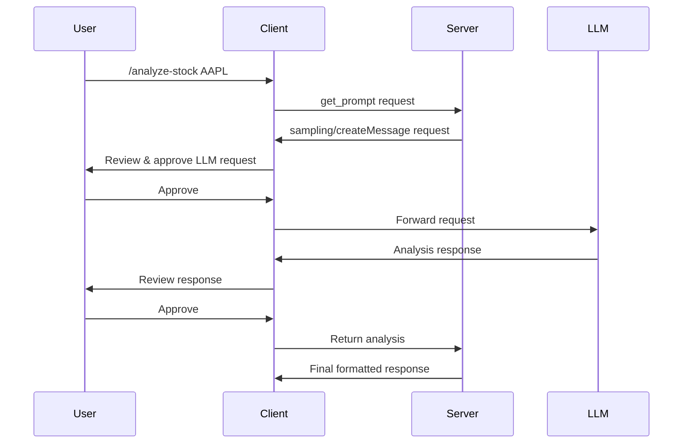

# 🤖 Financial MCP Server - AI Sampling Guide

This guide explains how **MCP Sampling** enables your financial server to request LLM-powered analysis from clients, creating sophisticated AI-driven financial insights.

## What is MCP Sampling?

**Sampling** allows your MCP server to request LLM generations from the client, enabling:
- ✅ **AI-powered financial analysis** without server API keys
- ✅ **Human-in-the-loop approval** for all LLM requests  
- ✅ **Model flexibility** - client chooses the best available LLM
- ✅ **Nested AI workflows** within financial tools

## How It Works



## New AI-Powered Tools

### 1. **AI Financial Analysis** (`ai_financial_analysis`)

**Purpose**: Get comprehensive AI-powered analysis of any company

**Parameters**:
- `ticker` (required): Stock symbol (e.g., AAPL, MSFT)
- `analysis_type` (required): comprehensive | valuation | risks | opportunities | comparison
- `context` (optional): Additional context or specific questions

**Example Usage**:
```json
{
  "name": "ai_financial_analysis",
  "arguments": {
    "ticker": "AAPL",
    "analysis_type": "comprehensive",
    "context": "Focus on iPhone revenue trends and services growth"
  }
}
```

**What It Does**:
1. Fetches company facts, financial metrics, and current price data
2. Sends structured data to LLM via sampling request
3. Returns AI-generated analysis with specific insights and recommendations

### 2. **AI Market Insights** (`ai_market_insights`)

**Purpose**: Get AI-powered market analysis and trend insights

**Parameters**:
- `focus_area` (required): overall_market | sector_analysis | economic_indicators | risk_assessment
- `tickers` (optional): Array of specific tickers to analyze
- `context` (optional): Specific questions or focus areas

**Example Usage**:
```json
{
  "name": "ai_market_insights",
  "arguments": {
    "focus_area": "sector_analysis",
    "tickers": ["AAPL", "MSFT", "GOOGL"],
    "context": "Compare big tech companies in current market environment"
  }
}
```

## Sampling Implementation Details

### **Model Preferences**
Your server uses intelligent model selection:

```typescript
{
  hints: [
    { name: "claude-3-sonnet" },  // Prefer high-quality models
    { name: "gpt-4" }             // Fallback to GPT-4
  ],
  intelligencePriority: 0.95,    // Prioritize intelligence for financial analysis
  speedPriority: 0.4,            // Speed is less critical
  costPriority: 0.3              // Cost is less critical for quality analysis
}
```

### **System Prompts**
Specialized prompts for financial analysis:

- **Financial Analysis**: "You are an expert financial analyst. Provide comprehensive, accurate, and actionable financial analysis..."
- **Market Insights**: "You are an expert market analyst. Provide comprehensive market insights covering current trends..."

### **Human-in-the-Loop Safety**
Following MCP best practices:
- ✅ User approval required for all sampling requests
- ✅ Users can review and edit prompts before sending
- ✅ Generated responses presented for review before delivery
- ✅ Full transparency in what data is sent to LLM

## Usage Examples

### **Example 1: Comprehensive Stock Analysis**

```bash
# User command
/analyze-stock ticker:TSLA analysis_depth:comprehensive

# Server generates sampling request
{
  "method": "sampling/createMessage",
  "params": {
    "messages": [
      {
        "role": "user", 
        "content": {
          "type": "text",
          "text": "Analyze TSLA with comprehensive financial data..."
        }
      }
    ],
    "systemPrompt": "You are an expert financial analyst...",
    "modelPreferences": {...},
    "maxTokens": 4000
  }
}

# Client shows user the request for approval
# LLM generates detailed TSLA analysis
# User reviews and approves the response
```

### **Example 2: AI Market Insights**

```bash
# Tool call
ai_market_insights focus_area:sector_analysis tickers:["AAPL","MSFT"]

# Generates market analysis comparing Apple and Microsoft
# Includes sector trends, competitive positioning, and outlook
```

## Benefits of Sampling Integration

### **1. No Server API Keys Required**
- Server doesn't need direct LLM access
- Client manages all model credentials
- Reduces security complexity

### **2. Model Flexibility**
- Client chooses best available model
- Automatic fallback to alternative models
- Provider-agnostic implementation

### **3. Enhanced Analysis Quality**
- Combines real financial data with AI insights
- Structured prompts for consistent output
- Context-aware analysis based on specific requests

### **4. User Control**
- Full transparency in AI requests
- User approval for all LLM interactions
- Ability to modify prompts before execution

## Integration with Existing Features

Your financial server now offers **three tiers of analysis**:

1. **Raw Data Tools**: Direct API data (existing tools)
2. **Structured Prompts**: Template-based analysis (existing prompts)  
3. **AI-Powered Tools**: Dynamic LLM analysis (new sampling tools)

This creates a comprehensive financial analysis platform that combines the reliability of structured data with the intelligence of AI-powered insights!

## Security & Privacy

- ✅ **Data Minimization**: Only necessary financial data sent to LLM
- ✅ **User Consent**: Explicit approval required for all sampling
- ✅ **Audit Trail**: All sampling requests logged
- ✅ **No Persistent Storage**: LLM doesn't retain conversation history
- ✅ **Client-Controlled**: Client manages all model interactions